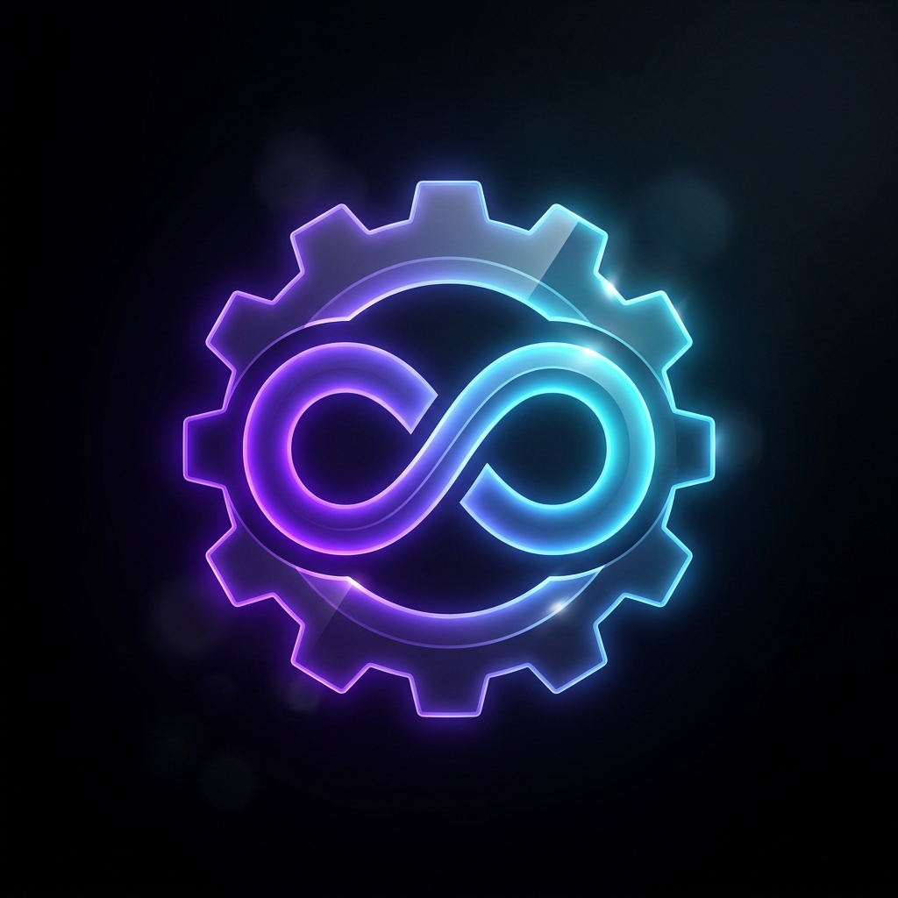



  

<h1 align="center">Omni Tool</h1>

  <strong>The Heavy-Duty, 100% Client-Side WebAssembly Media & Document Suite</strong>

  
  
  
  
  

---

## ⚡ Overview

**Omni Tool** is a high-performance, private media engineering suite and document workstation that runs entirely in your browser and on your Android device. 

Unlike traditional cloud converters that upload your sensitive documents and videos to remote servers, Omni Tool executes everything **100% on-device** using self-hosted **WebAssembly (FFmpeg WASM)**. Not a single byte leaves your hardware.

---

## 🚀 Instant Download & Live App

| Platform | Access Link | Description |
| :--- | :--- | :--- |
| **🌐 Web App** | [**omni-tool-two.vercel.app**](https://omni-tool-two.vercel.app) | Live PWA with zero install required. |
| **📱 Android APK** | [**Download omni-tool-v2.4.3.apk**](https://github.com/lagtastic-legends/omni-tool/releases/download/v2.4.3/omni-tool-v2.4.3.apk) | Direct install for normal phones, foldables, flips, and tablets. |

---

## ✨ Features & Modules

### 🎥 Video Engineering
* **Video Compressor**: Smart multi-tier CRF and preset compression with zero quality loss.
* **Universal Media Converter**: Transcode MP4, MKV, WebM, AVI, MOV, and more client-side.
* **GIF Studio**: Convert video segments into optimized animated GIFs with custom framerate and palette control.

### 🎵 Audio Workbench & Sound Lab
* **Audio Workbench**: Waveform slicing, trimming, bitrate control, and format transcoding.
* **Spatial 8D Audio**: Circular binaural panning engine that rotates sound around the listener.
* **Bass Booster**: Deep low-end acoustic amplification and harmonic enhancement.
* **Studio Equalizer**: 5-band frequency graphic EQ with real-time gain adjustment.
* **Slowed + Reverb**: Transform tracks into ambient, dreamy slowed-down soundscapes.
* **Reverse Audio**: Exact reverse-playback audio generator.
* **Ringtone Maker**: Precise audio trimming with lossless m4r/mp3 exports.

### 📄 Document & PDF Forge
* **Image to PDF**: Combine multiple PNGs, JPEGs, and WebPs into a unified document.
* **Scan to PDF**: Capture or import camera receipts, documents, and whiteboard notes with edge correction.
* **Lock PDF**: AES password protection and encryption for sensitive PDF documents.
* **Text to PDF**: Clean markdown and plaintext formatter with pagination control.
* **QR Studio**: Generator & reader with high error correction and logo embedding.
* **ASCII Art Studio**: Convert visual images into retro terminal typography.

### 🔒 Vault & Offline Privacy
* **Local Vault**: Persistent client-side file archive using IndexedDB and native sandbox storage.
* **Studio Recorder**: Screen recording, microphone audio capture, and live device streaming.

---

## 🏛️ Architecture & Principles

`
  ┌─────────────────────────────────────────────────────────┐
  │                 OMNI TOOL RUNTIME                       │
  │                                                         │
  │   Next.js 16 (App Router) + Tailwind CSS + Radix UI     │
  │   Framer Motion (Newtonian Spring Micro-Interactions)   │
  └───────────────────────────┬─────────────────────────────┘
                              │
               ┌──────────────┴──────────────┐
               ▼                             ▼
   ┌───────────────────────┐     ┌───────────────────────┐
   │  WebAssembly Engine   │     │  Capacitor Shell      │
   │  @ffmpeg/core (WASM)  │     │  Native Android APK   │
   │  Local File Buffers   │     │  Thumb-Zone Layout    │
   │  Zero Network Sockets │     │  Edge-to-Edge Padding │
   └───────────────────────┘     └───────────────────────┘
`

1. **Zero-Upload Guarantee**: We operate no cloud ingestion servers. All CPU/GPU operations are executed locally.
2. **Tactile Craftsmanship**: Custom mathematically off-grid OKLCH color palettes, fluid typography (clamp()), and physical spring physics (stiffness: 450, damping: 24).
3. **Ergonomic Native Design**: Optimized thumb-zone navigation, safe-area-inset adaptation, and native responsiveness for slabs, flips, folds, and tablets.

---

## 🛠️ Tech Stack

* **Framework**: [Next.js 16 (App Router)](https://nextjs.org/)
* **Engine**: [FFmpeg.wasm](https://github.com/ffmpegwasm/ffmpeg.wasm) & [pdf-lib](https://pdf-lib.js.org/)
* **Mobile Runtime**: [Capacitor 8](https://capacitorjs.com/)
* **Styling**: [Tailwind CSS 4](https://tailwindcss.com/)
* **Motion Physics**: [Framer Motion](https://www.framer.com/motion/)
* **State & DB**: [Zustand](https://github.com/pmndrs/zustand) + IndexedDB
* **Icons**: [Lucide React](https://lucide.dev/)

---

## 💻 Quick Start & Development

### 1. Clone & Install
`ash
git clone https://github.com/lagtastic-legends/omni-tool.git
cd omni-tool
npm install
`

### 2. Run Local Development
`ash
npm run dev
`
Open [http://localhost:3000](http://localhost:3000) to view the workspace.

### 3. Build Web Static Export
`powershell
 = "1"; npm run build
`

### 4. Build Android APK
`powershell
npx cap sync android
cd android
.\gradlew.bat assembleDebug
`
The output APK will be generated at:
ndroid/app/build/outputs/apk/debug/app-debug.apk

---

## 🛡️ Security & Privacy

For full security disclosure and privacy guarantees, please refer to [SECURITY.md](SECURITY.md).

---

## 🤝 Contributing

Contributions, bug reports, and feature suggestions are welcome! See [CONTRIBUTING.md](CONTRIBUTING.md) to get started.

---

## 📬 Support & Contact

* **Official Support Email**: [support.omnitool.com@gmail.com](mailto:support.omnitool.com@gmail.com)
* **Website**: [https://omni-tool-two.vercel.app](https://omni-tool-two.vercel.app)

---

## 📄 License

This project is open source and available under the [MIT License](LICENSE).
